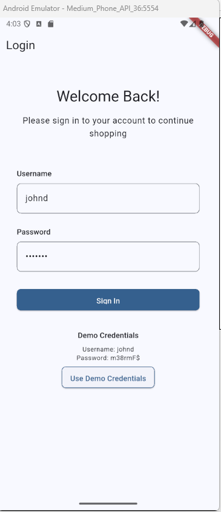
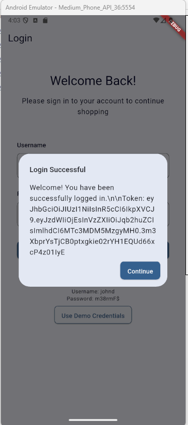
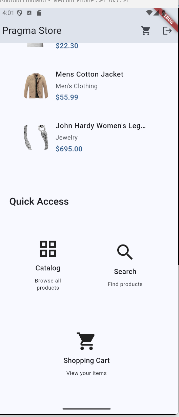
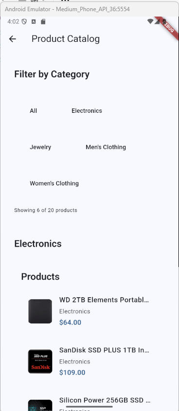
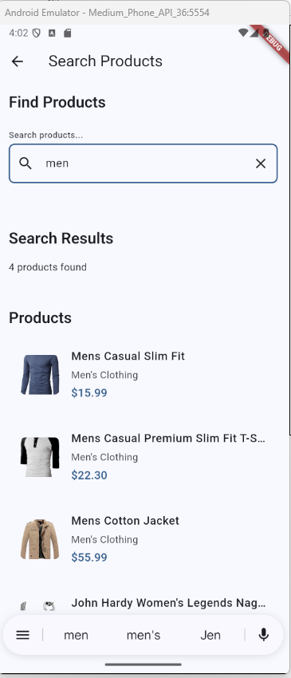
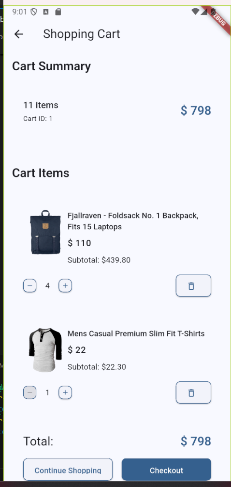

# Documentación – Fase 5 eCommerce Flutter

**pragma_app_shell** - Aplicación eCommerce con arquitectura modular

---

## 🚀 Cómo ejecutar el proyecto

### Requisitos previos
- **Flutter SDK**: 3.7.2 o superior
- **Dart SDK**: Incluido con Flutter
- **Android Studio** / **VS Code** con extensiones de Flutter
- **Dispositivo Android/iOS** o **Emulador**

### Dependencias de paquetes locales
Este proyecto depende de dos paquetes desarrollados localmente:
- **`pragma_design_system`** - Sistema de diseño reusable
- **`fake_maker_api_pragma_api`** - Manejo de API y lógica de negocio

⚠️ Los paquetes `pragma_design_system` y `fake_maker_api_pragma_api` deben estar al mismo nivel del proyecto o correctamente referenciados por path en el pubspec.yaml.

### Pasos para ejecutar
1. **Clonar el repositorio y paquetes dependientes**
   ```bash
   git clone <repository-url>
   cd pragma_app_shell
   ```

2. **Instalar dependencias**
   ```bash
   flutter pub get
   ```

3. **Ejecutar la aplicación**
   ```bash
   flutter run
   ```

4. **Para compilar para producción**
   ```bash
   flutter build apk --release
   flutter build ios --release
   ```

---

## 📋 Diagrama de Flujo de la Aplicación


*Diagrama que muestra el flujo completo de navegación y interacción del usuario en la aplicación eCommerce*

---

## 🧩 1. Estructura General de la Aplicación

La aplicación eCommerce fue desarrollada siguiendo principios de **Clean Architecture** y separación clara de responsabilidades, utilizando dos paquetes propios:

- **`pragma_design_system`** → Sistema de diseño reusable
- **`fake_maker_api_pragma_api`** → Consumo de la Fake Store API con casos de uso y BLoC

Esto permite que el proyecto principal se enfoque únicamente en la composición de pantallas y el flujo comercial.

```
pragma_app_shell/
 ├── pages/
 │    ├── home/
 │    ├── catalog/
 │    ├── product_detail/
 │    ├── cart/
 │    ├── login/
 │    └── support/
 ├── routes/
 ├── main.dart
```

---

## 🎨 2. Integración del Sistema de Diseño

Toda la UI fue construida exclusivamente con componentes del paquete:

**`pragma_design_system`**

Se utilizaron componentes como:
- `AppPage`
- `AppSection`
- `AppCard`
- `AppButton`
- `AppText`
- `AppSpacer`
- `AppImage`
- `AppPrice`
- `AppEmptyStateSection`
- `AppDialog`

**Esto garantiza:**
- ✅ Consistencia visual
- ✅ Reutilización
- ✅ Separación total entre UI y lógica
- ✅ Facilidad para escalar el diseño sin tocar el eCommerce

---

## 🔌 3. Integración del paquete Fake Store API

La lógica de negocio y acceso a datos **no vive en el eCommerce**.

Se reutilizó el paquete:

**`fake_maker_api_pragma_api`**

**El cual provee:**
- Entidades (`Product`, `Cart`, etc.)
- Casos de uso (`GetProducts`, `GetCartWithProductDetails`, etc.)
- BLoC (`CartBloc`, `ProductBloc`, etc.)
- Manejo de errores con `Failure`

Esto permite que el eCommerce sea un **cliente del dominio**, no su dueño.

---

## 🗂️ 4. Páginas Implementadas

| Página | Descripción | Fuente de datos |
|--------|-------------|----------------|
| **Home** | Vista general, navegación | Local + API |
| **Product List** | Catálogo por categorías | API |
| **Search** | Filtro local de productos ya cargados | Local |
| **Product Detail** | Información detallada | API |
| **Login** | Simulación de autenticación | Local |
| **Cart** | Gestión completa del carrito | API + CartBloc |
| **Support** | Información y formulario de contacto | Estático |

---

## 🔄 5. Flujo de la Aplicación (alto nivel)

1. Usuario entra a **Home**
2. Navega al **catálogo**
3. Ve **detalles del producto**
4. **Agrega al carrito**
5. Gestiona **cantidades en Cart**
6. Puede contactar **soporte**

**El flujo comercial completo está cubierto.**

---

## 🧠 6. Decisiones de Diseño Importantes

### ✅ El eCommerce NO tiene lógica de negocio
Toda la lógica vive en los paquetes externos.

### ✅ UI 100% basada en Design System
No se usan widgets de Flutter directos para UI visual.

### ✅ Reutilización real de paquetes propios
La app demuestra cómo consumir paquetes internos como si fueran librerías externas.

### ✅ Manejo de estados con BLoC provisto por el paquete API
El eCommerce no implementa su propio BLoC.

### 🏗️ Separación Real de Capas

| Capa | Paquete/Módulo | Responsabilidades | Tecnologías |
|------|----------------|-------------------|-------------|
| **UI/Presentación** | `pragma_app_shell` | • Composición de pantallas<br>• Navegación entre páginas<br>• Manejo de rutas<br>• Integración de componentes | Flutter Widgets, Navigation |
| **Sistema de Diseño** | `pragma_design_system` | • Componentes UI reutilizables<br>• Tokens de diseño<br>• Consistencia visual<br>• Temas y estilos | Custom Flutter Components |
| **Dominio/Lógica** | `fake_maker_api_pragma_api` | • Casos de uso<br>• Entidades de negocio<br>• Reglas de negocio<br>• Gestión de estados | BLoC, Use Cases, Entities |
| **Datos/API** | `fake_maker_api_pragma_api` | • Consumo de APIs<br>• Modelos de datos<br>• Repositorios<br>• Manejo de errores | HTTP, JSON, Repository Pattern |

**Ventajas de esta separación:**
- ✅ **Mantenibilidad**: Cada capa tiene responsabilidades claras
- ✅ **Escalabilidad**: Fácil agregar nuevas funcionalidades
- ✅ **Testabilidad**: Cada capa se puede testear independientemente
- ✅ **Reutilización**: Los paquetes pueden usarse en otros proyectos

---

## 📱 7. Responsive Design

La aplicación fue construida utilizando:

- `Expanded`
- `Flexible`
- `SingleChildScrollView`
- Componentes adaptables del Design System

Permitiendo que funcione correctamente en **diferentes tamaños de pantalla y orientaciones**.

---

## 🧪 8. Funcionalidades Implementadas

- ✔ Navegación por categorías
- ✔ Búsqueda local sin endpoint adicional
- ✔ Detalle de producto
- ✔ Gestión de carrito (cantidad, eliminar, total)
- ✔ Pantalla de login
- ✔ Pantalla de soporte y contacto

---

## 📱 9. Capturas de Pantalla

### Login y Autenticación



*Pantalla de login con credenciales demo y flujo de autenticación*

### Home y Navegación  


*Página principal con productos destacados y accesos rápidos*

### Catálogo y Búsqueda



*Catálogo con filtros por categorías y búsqueda local*

### Carrito de Compras


*Gestión completa del carrito con cantidades y totales*

---

## 🧠 Decisiones Arquitectónicas que Demuestran Escalabilidad

✅ **El eCommerce podría cambiar completamente de API sin modificar la UI.**

✅ **El Design System podría usarse en una app diferente sin cambios.**

✅ **La lógica de negocio podría exponerse a una app móvil, web o backend sin modificaciones.**

✅ **El proyecto demuestra cómo diseñar software pensando en reutilización real y separación total de capas.**

---

## 🏁 10. Conclusión

Esta aplicación demuestra:

- **Arquitectura limpia**
- **Reutilización de paquetes propios**
- **Separación de responsabilidades**
- **Consistencia visual**
- **Flujo comercial completo de un eCommerce**

> *"Esta persona no hizo una app… diseñó un sistema."*
