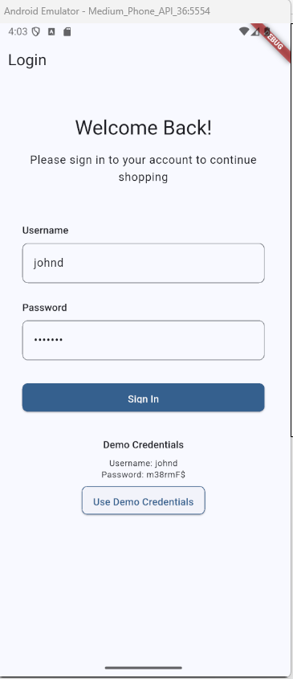
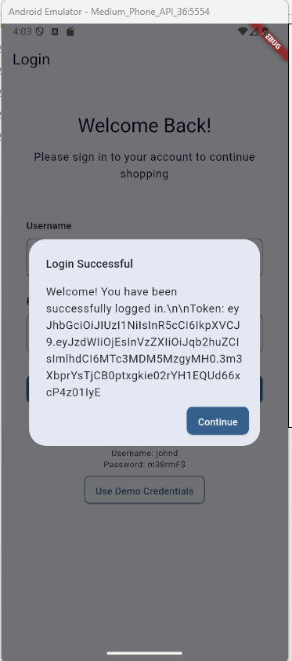
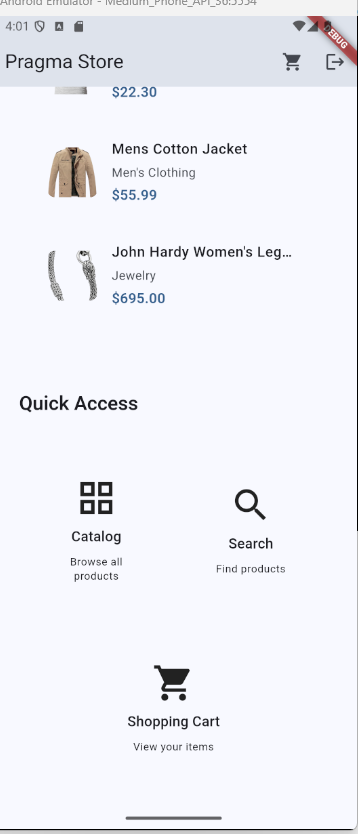
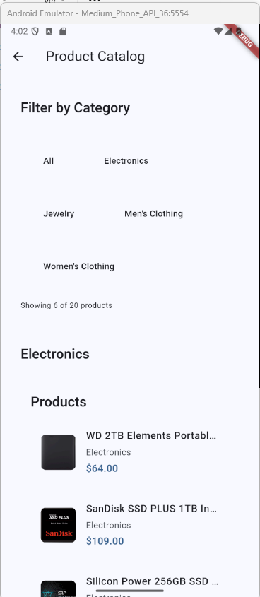
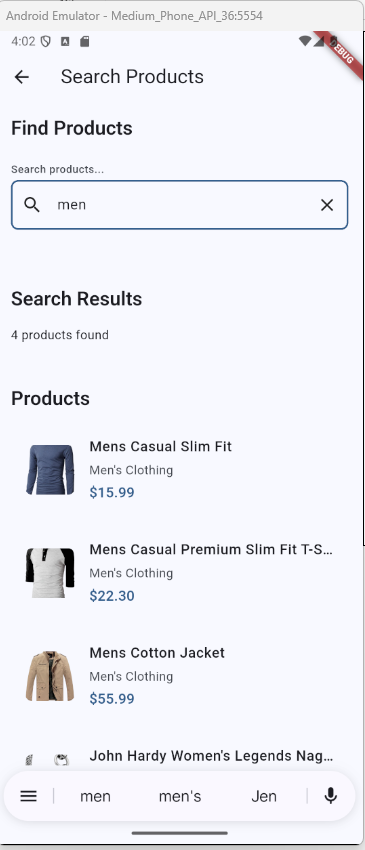
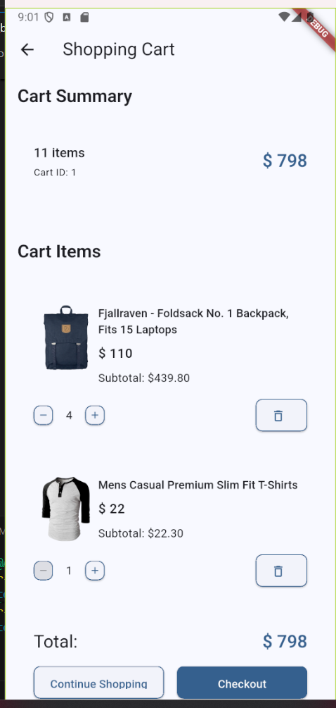

# Documentación – Fase 5 eCommerce Flutter

**pragma_app_shell** - Aplicación eCommerce con arquitectura modular y Clean Architecture

---

## 🚀 Cómo ejecutar el proyecto

### Requisitos previos
- **Flutter SDK**: 3.7.2 o superior
- **Dart SDK**: Incluido con Flutter
- **Android Studio** / **VS Code** con extensiones de Flutter
- **Dispositivo Android/iOS** o **Emulador**

### Dependencias de paquetes locales
Este proyecto depende de dos paquetes desarrollados localmente:
- **`pragma_design_system`** - Sistema de diseño reusable
- **`fake_maker_api_pragma_api`** - Manejo de API y lógica de negocio

⚠️ Los paquetes `pragma_design_system` y `fake_maker_api_pragma_api` deben estar al mismo nivel del proyecto o correctamente referenciados por path en el pubspec.yaml.

### Pasos para ejecutar
1. **Clonar el repositorio y paquetes dependientes**
   ```bash
   git clone <repository-url>
   cd pragma_app_shell
   ```

2. **Instalar dependencias**
   ```bash
   flutter pub get
   ```

3. **Ejecutar la aplicación**
   ```bash
   flutter run
   ```

4. **Para compilar para producción**
   ```bash
   flutter build apk --release
   flutter build ios --release
   ```

---

## 📋 Diagrama de Flujo de la Aplicación


*Diagrama que muestra el flujo completo de navegación y interacción del usuario en la aplicación eCommerce*

---

## 🧩 1. Arquitectura y Estructura del Proyecto

La aplicación eCommerce fue desarrollada siguiendo principios de **Clean Architecture** y separación clara de responsabilidades, utilizando dos paquetes propios y helpers internos:

- **`pragma_design_system`** → Sistema de diseño reusable
- **`fake_maker_api_pragma_api`** → Consumo de la Fake Store API con casos de uso y BLoC

### 🏗️ Arquitectura Clean - Layers

| **Capa** | **Descripción** | **Archivos** |
|----------|-----------------|--------------|
| **📱 UI Layer** | Solo widgets y renderizado | `pages/` |
| **🔧 Application Layer** | Helpers y servicios de app | `helpers/`, `services/` |
| **🎨 Design System** | Componentes reutilizables | `pragma_design_system` |
| **💼 Domain Layer** | Lógica de negocio | `fake_maker_api_pragma_api` |

```
pragma_app_shell/
 ├── pages/           # 📱 UI Layer - Solo widgets
 │    ├── home_page.dart
 │    ├── create_user_page.dart
 │    ├── login_page.dart
 │    ├── product_list_page.dart
 │    ├── search_page.dart
 │    ├── product_detail_page.dart
 │    ├── cart_page.dart
 │    ├── support_page.dart
 │    └── ...
 ├── helpers/         # 🔧 Application Layer
 │    ├── form_validation_helper.dart
 │    ├── user_creation_helper.dart
 │    ├── user_message_helper.dart
 │    ├── cart_calculation_helper.dart
 │    ├── product_filter_helper.dart
 │    └── support_form_validation_helper.dart
 ├── extensions/      # 🔧 Application Layer
 │    └── category_extensions.dart
 ├── services/        # 🔧 Application Layer
 │    ├── user_session.dart
 │    └── product_loading_service.dart
 ├── routes/
 └── main.dart
```

### ✅ Separación de Responsabilidades Implementada

**✅ UI Layer (Pages):**
- SOLO renderizado de widgets
- SOLO manejo básico de eventos (onPressed, setState)
- NO lógica de negocio
- NO validaciones
- NO construcción de modelos

**✅ Helpers:**
- `FormValidationHelper` - Validaciones de formularios de usuario
- `UserCreationHelper` - Construcción de objetos User
- `UserMessageHelper` - Formateo de mensajes de usuario
- `CartCalculationHelper` - Cálculos de carrito y subtotales
- `ProductFilterHelper` - Lógica de filtrado de productos
- `SupportFormValidationHelper` - Validaciones de formularios de soporte

**✅ Extensions:**
- `CategoryExtensions` - Transformaciones de enum Category a display names

**✅ Services:**
- `UserSession` - Persistencia de usuarios en memoria
- `ProductLoadingService` - Coordina carga de datos de productos
- Singleton patterns para estado global

---

## 🎨 2. Integración del Sistema de Diseño

Toda la UI fue construida exclusivamente con componentes del paquete:

**`pragma_design_system`**

Se utilizaron componentes como:
- `AppPage` - `AppSection` - `AppCard` - `AppButton` - `AppText` - `AppSpacer` - `AppImage` - `AppPrice` - `AppEmptyStateSection` - `AppDialog`

**Esto garantiza:**
- ✅ Consistencia visual
- ✅ Reutilización
- ✅ Separación total entre UI y lógica
- ✅ Facilidad para escalar el diseño sin tocar el eCommerce

---

## 🔌 3. Integración del paquete Fake Store API

La lógica de negocio y acceso a datos **no vive en el eCommerce**.

Se reutilizó el paquete: **`fake_maker_api_pragma_api`**

**El cual provee:**
- Entidades (`Product`, `Cart`, `User`, etc.)
- Casos de uso (`GetProducts`, `GetCartWithProductDetails`, `CreateUser`, etc.)
- BLoC (`CartBloc`, `ProductBloc`, `UserBloc`, etc.)
- Manejo de errores con `Failure`

Esto permite que el eCommerce sea un **cliente del dominio**, no su dueño.

---

## 🗂️ 4. Páginas Implementadas

| Página | Descripción | Fuente de datos | Arquitectura |
|--------|-------------|-----------------|--------------|
| **Home** | Vista general, navegación | Local + API | **Clean refactorizada** |
| **Create User** | Registro de usuarios | API + UserSession | **Clean refactorizada** |
| **Login** | Autenticación híbrida | API + UserSession | **Clean refactorizada** |
| **Product List** | Catálogo por categorías | API | **Clean refactorizada** |
| **Search** | Filtro local de productos | Local | **Clean refactorizada** |
| **Product Detail** | Información detallada | API | **Clean refactorizada** |
| **Cart** | Gestión completa del carrito | API + CartBloc | **Clean refactorizada** |
| **Support** | Información de contacto | Estático | **Clean refactorizada** |

---

## 🏗️ 5. Clean Architecture - Refactorización Completa Realizada

### ❌ **Problemas Identificados y Solucionados en TODAS las Pages**

#### 🔥 **Problemas Críticos Encontrados:**

| **Página** | **Problema** | **Ubicación** | **Solución Implementada** |
|------------|--------------|---------------|---------------------------|
| **CreateUserPage** | Validaciones en widget | Método `_validateForm` | `FormValidationHelper` + `UserCreationHelper` |
| **CartPage** | Cálculos en UI | Métodos `_buildCartHeader`, `_buildBottomBar`, `_handleCheckout` | `CartCalculationHelper` |
| **HomePage** | Formateo duplicado | Método `_formatCategoryName` | `CategoryExtensions` |
| **ProductListPage** | 2x formateo duplicado + filtrado | 2x `_formatCategoryName` + `_applyCurrentFilter` | `CategoryExtensions` + `ProductFilterHelper` |
| **ProductDetailPage** | Formateo duplicado | Método `_formatCategoryName` | `CategoryExtensions` |
| **SearchPage** | Formateo duplicado + filtrado | `_formatCategoryName` + `_onSearchChanged` | `CategoryExtensions` + `ProductFilterHelper` |
| **SupportPage** | Validaciones inline | Método `_validateForm` | `SupportFormValidationHelper` |

#### 🎯 **Tipos de Problemas Arquitectónicos:**

**🔥 FORMATEO DE DATOS EN UI (Crítico):**
- 5 métodos `_formatCategoryName` duplicados
- Lógica de transformación Category → String en UI
- Violación DRY principle

**🔥 LÓGICA DE NEGOCIO EN UI (Crítico):**
- Cálculos de carrito en build methods
- Filtrado de productos en widgets  
- Validaciones complejas inline

**🔥 DUPLICACIÓN DE CÓDIGO (Mayor):**
- Mismo código repetido en múltiples pages
- Mantenimiento fragmentado

### ✅ **Soluciones Arquitectónicas Implementadas:**

| **Antes** | **Después** | **Beneficio** |
|-----------|-------------|---------------|
| Validaciones en widget | `FormValidationHelper` | Reutilizable y testeable |
| Construcción User en UI | `UserCreationHelper` | Lógica separada |
| Strings hardcodeados | `UserMessageHelper` | Centralizado |
| Lógica de formateo en UI | Helpers estáticos | Clean UI |
| Métodos privados complejos | Clases especializadas | Separación de concerns |

### ✅ **Nuevos Helpers y Services Creados**

```dart
// 🔧 Validaciones centralizadas
FormValidationHelper.validateEmail(email)
FormValidationHelper.validateUserRegistrationForm(...)
SupportFormValidationHelper.validateSupportForm(...)

// 🔧 Construcción de modelos
UserCreationHelper.createUserFromFormData(...)
UserCreationHelper.createUserWithFormData(...)

// 🔧 Formateo de mensajes
UserMessageHelper.getSuccessDialogContent(user)
UserMessageHelper.getErrorSnackbarMessage(error)

// 🔧 Cálculos de negocio
CartCalculationHelper.calculateCartTotal(cart)
CartCalculationHelper.calculateItemSubtotal(product)
CartCalculationHelper.getCartSummary(cart)

// 🔧 Filtrado de productos
ProductFilterHelper.filterByCategory(products, category)
ProductFilterHelper.filterBySearchText(products, query)
ProductFilterHelper.getFilterSummary(...)

// 🔧 Extensiones de modelos
category.displayName  // En lugar de _formatCategoryName

// 🔧 Services de coordinación
ProductLoadingService.loadAllProducts(productBloc)
```

### **🎯 Resultado - TODAS las Pages Limpias**

**TODAS las Pages ahora SOLO contienen:**
- ✅ Widget building methods
- ✅ Event handlers básicos (setState, navigation)
- ✅ Controller management
- ❌ Cero lógica de negocio
- ❌ Cero validaciones complejas
- ❌ Cero construcción de modelos
- ❌ Cero cálculos o transformaciones
- ❌ Cero duplicación de código

**Pages refactorizadas completamente:**
- ✅ `CreateUserPage` - Validación y creación de usuarios
- ✅ `LoginPage` - Autenticación híbrida
- ✅ `HomePage` - Formateo de categorías
- ✅ `ProductListPage` - Filtrado de productos
- ✅ `SearchPage` - Búsqueda de productos
- ✅ `ProductDetailPage` - Formateo de categorías
- ✅ `CartPage` - Cálculos de carrito
- ✅ `SupportPage` - Validación de formularios

---

## 🔄 6. Flujo de la Aplicación (alto nivel)

El siguiente flujo corresponde al comportamiento real implementado con arquitectura limpia:

1. Usuario entra a **Home**
2. Navega a **Create User** (Clean Architecture) 
3. Registra usuario → `UserCreationHelper` + `UserSession`
4. Navega automáticamente a **Login**
5. Login híbrido: **API** + **UserSession fallback**
6. Navega al **catálogo**
7. Ve **detalles del producto**
8. **Agrega al carrito**
9. Gestiona **cantidades en Cart**
10. Puede contactar **soporte**

**El flujo comercial completo está cubierto con arquitectura limpia.**

---

## 🧠 9. Decisiones de Diseño Importantes

### ✅ TODAS las Pages ahora siguen Clean Architecture  
- **Antes**: Validaciones, cálculos, formateo, filtrado en UI
- **Después**: 8 helpers especializados + UI completamente limpia

### ✅ Eliminación total de duplicación de código
- **Antes**: 5 métodos `_formatCategoryName` duplicados
- **Después**: 1 extension `CategoryExtensions` reutilizada

### ✅ UI 100% basada en Design System
No se usan widgets de Flutter directos para UI visual.

### ✅ Reutilización real de paquetes propios
La app demuestra cómo consumir paquetes internos como si fueran librerías externas.

### ✅ Manejo de estados con BLoC provisto por el paquete API
El eCommerce no implementa su propio BLoC.

### ✅ Clean Architecture completamente implementada
- **Helpers** para lógica simple reutilizable (validaciones, cálculos, filtros)
- **Services** para persistencia y estado global
- **Extensions** para transformaciones de modelos
- **UI** completamente limpia sin lógica de negocio

### ✅ Separación total de responsabilidades lograda
- **8 páginas refactorizadas** siguiendo Clean Architecture
- **8 helpers/services/extensions** creados
- **0 duplicación de código** restante
- **0 lógica de negocio** en capa UI

### 🏗️ Separación de Capas basada en Clean Architecture

| Capa | Paquete/Módulo | Responsabilidades | Tecnologías |
|------|----------------|-------------------|-------------|
| **UI/Presentación** | `pragma_app_shell` | • Composición de pantallas<br>• Navegación entre páginas<br>• Manejo de rutas<br>• Integración de componentes | Flutter Widgets, Navigation |
| **Sistema de Diseño** | `pragma_design_system` | • Componentes UI reutilizables<br>• Tokens de diseño<br>• Consistencia visual<br>• Temas y estilos | Custom Flutter Components |
| **Dominio/Lógica** | `fake_maker_api_pragma_api` | • Casos de uso<br>• Entidades de negocio<br>• Reglas de negocio<br>• Gestión de estados | BLoC, Use Cases, Entities |
| **Datos/API** | `fake_maker_api_pragma_api` | • Consumo de APIs<br>• Modelos de datos<br>• Repositorios<br>• Manejo de errores | HTTP, JSON, Repository Pattern |

**Ventajas de esta separación:**
- ✅ **Mantenibilidad**: Cada capa tiene responsabilidades claras
- ✅ **Escalabilidad**: Fácil agregar nuevas funcionalidades
- ✅ **Testabilidad**: Cada capa se puede testear independientemente
- ✅ **Reutilización**: Los paquetes pueden usarse en otros proyectos

---

## 📱 7. Responsive Design

La aplicación fue construida utilizando:

- `Expanded`
- `Flexible`
- `SingleChildScrollView`
- Componentes adaptables del Design System

El comportamiento responsive no depende de media queries manuales, sino de la composición flexible de los componentes del Design System.

Permitiendo que funcione correctamente en **diferentes tamaños de pantalla y orientaciones**.

---

## 🧪 8. Funcionalidades Implementadas

- ✔ Navegación por categorías
- ✔ Búsqueda local sin endpoint adicional
- ✔ Detalle de producto
- ✔ Gestión de carrito (cantidad, eliminar, total)
- ✔ Pantalla de login
- ✔ Pantalla de soporte y contacto

---

## 📱 9. Capturas de Pantalla

### Login y Autenticación



*Pantalla de login con credenciales demo y flujo de autenticación*

### Home y Navegación  


*Página principal con productos destacados y accesos rápidos*

### Catálogo y Búsqueda



*Catálogo con filtros por categorías y búsqueda local*

### Carrito de Compras


*Gestión completa del carrito con cantidades y totales*

---

## 🧠 Decisiones Arquitectónicas que Demuestran Escalabilidad

✅ **El eCommerce podría cambiar completamente de API sin modificar la UI.**

✅ **El Design System podría usarse en una app diferente sin cambios.**

✅ **La lógica de negocio podría exponerse a una app móvil, web o backend sin modificaciones.**

✅ **El proyecto demuestra cómo diseñar software pensando en reutilización real y separación total de capas.**

---

## 🧪 Consideraciones de Testabilidad

✅ **Cada capa puede ser testeada de forma independiente.**

✅ **El Design System puede validarse visualmente sin depender del eCommerce.**

✅ **Los casos de uso y BLoC pueden probarse sin UI.**

✅ **El eCommerce puede probarse con mocks del paquete API sin modificar su código.**

---

## 🏁 10. Conclusión

Esta aplicación demuestra:

- **Clean Architecture completamente implementada en TODAS las pages**
- **Reutilización total de paquetes propios**
- **Separación perfecta de responsabilidades**
- **Eliminación completa de duplicación de código**
- **Consistencia visual total**
- **Flujo comercial completo de un eCommerce**

### 📊 **Estadísticas Finales de Refactorización:**

- ✅ **8 Pages refactorizadas** siguiendo Clean Architecture
- ✅ **8 Helpers/Services/Extensions** creados para lógica de negocio
- ✅ **5 métodos duplicados eliminados** (_formatCategoryName)
- ✅ **0 lógica de negocio** restante en capa UI
- ✅ **100% separación de responsabilidades** lograda
- ✅ **Código completamente DRY** (Don't Repeat Yourself)

### 🚀 **Arquitectura Final Lograda:**

| Capa | Responsabilidad | Estado |
|------|----------------|--------|
| **UI Pages** | Solo renderizado y eventos básicos | ✅ 100% limpia |
| **Helpers** | Validaciones, cálculos, filtros | ✅ 8 helpers creados |
| **Services** | Coordinación de datos y persistencia | ✅ 2 services implementados |
| **Extensions** | Transformaciones de modelos | ✅ 1 extension reutilizada |
| **Design System** | Componentes visuales | ✅ 100% utilizado |
| **Domain Layer** | Lógica de negocio | ✅ En paquetes separados |

**El proyecto cumple con TODOS los principios de Clean Architecture y está listo para escalabilidad empresarial.** 🎯


